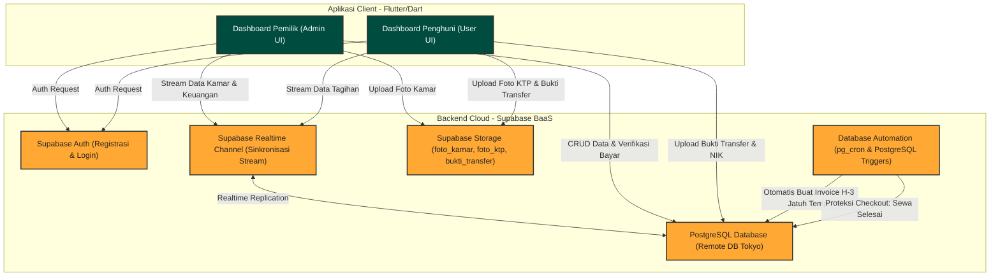

# 📄 PRODUCT REQUIREMENT DOCUMENT (PRD) - KOSKU APP (UAS SPECIAL EDITION)

## 1. Latar Belakang Masalah (Problem Background)
Aplikasi **KosKu** dirancang untuk memecahkan masalah operasional yang dihadapi oleh pengelola kos (Pemilik Kos) dan penghuni kamar kos dalam kehidupan sehari-hari. Manajemen pengelolaan kos-kosan secara tradisional sering kali terkendala oleh sistem pencatatan manual berbasis kertas atau percakapan obrolan instan (seperti WhatsApp) yang tidak terorganisir. Hal ini menimbulkan berbagai risiko operasional, antara lain:
*   **Kesalahan Pembukuan & Tunggakan:** Tidak adanya pencatatan tagihan bulanan yang teratur memicu kelalaian dalam menagih sewa atau keterlambatan pembayaran dari penghuni.
*   **Ketidakjelasan Rincian Biaya:** Tagihan bulanan sering kali memiliki komponen biaya tambahan (seperti listrik token/non-token, iuran kebersihan, air) yang sulit dirinci dan diakumulasikan secara manual secara transparan kepada penghuni.
*   **Pendataan Penghuni yang Tidak Tertib:** Kesulitan bagi pemilik kos untuk mengarsipkan kartu identitas resmi (KTP/NIK) dari penghuni yang tinggal, sehingga mempersulit administrasi keamanan lingkungan.
*   **Kesulitan Laba/Rugi Buku Kas:** Pengelola kos sering kali tidak mencatat biaya pengeluaran operasional harian/bulanan (seperti biaya perbaikan air, perbaikan AC, pembelian token listrik fasilitas umum), sehingga sulit memantau keuntungan bersih kos secara akurat.
*   **Alur Pengajuan Kamar yang Lambat:** Proses penghuni baru masuk kos memerlukan koordinasi manual yang lama untuk mendapatkan kunci, nomor kamar, dan pendaftaran data diri.

**KosKu** hadir sebagai platform mobile terintegrasi berbasis **Flutter** dan **Supabase Backend** yang menyinkronkan data pemilik kos dan penghuni secara *real-time*. Aplikasi ini menyederhanakan alur kerja sewa dengan otomatisasi pembuatan invoice bulanan, verifikasi pembayaran digital via struk transfer, validasi NIK/KTP penghuni, pencatatan kas masuk/keluar, dan pengelolaan kamar kos multi-tenant secara efisien.

---

## 2. Target Pengguna (Target Users)
Aplikasi KosKu membagi penggunanya ke dalam dua peran utama dengan alur kerja yang saling terintegrasi:

### 2.1 Pemilik / Pengelola Kos (Admin)
*   **Profil:** Individu atau entitas bisnis yang mengelola satu atau beberapa kamar kos.
*   **Kebutuhan Utama:**
    *   Melihat status keterisian kamar secara langsung (Terisi, Kosong, Perbaikan).
    *   Menerima dan menyetujui pengajuan penghuni kos baru yang mendaftar via kode token kamar.
    *   Melihat grafik dan rekapitulasi pemasukan bulanan serta mencatat pengeluaran operasional.
    *   Mengatur tagihan bulanan penyewa secara terperinci (sewa pokok, listrik, kebersihan) serta memverifikasi foto bukti transfer bank yang diunggah penyewa.
    *   Mengelola profil kos dan nomor kontak darurat.

### 2.2 Penghuni Kos (User)
*   **Profil:** Penyewa (mahasiswa, pekerja, keluarga) yang tinggal di salah satu kamar kos yang dikelola admin.
*   **Kebutuhan Utama:**
    *   Melakukan pendaftaran/masuk ke kamar kos secara mandiri dengan memasukkan kode token kamar yang didapatkan dari pemilik kos.
    *   Memantau jumlah hari tersisa sebelum tanggal jatuh tempo pembayaran sewa.
    *   Melihat rincian tagihan invoice bulanan aktif dengan pembagian komponen biaya yang transparan.
    *   Melakukan konfirmasi pembayaran dengan mengunggah foto struk bukti transfer dari HP.
    *   Melengkapi profil biodata diri secara legal termasuk menginput NIK dan mengunggah foto KTP.

---

## 3. Arsitektur Sistem (System Architecture)
Aplikasi KosKu mengadopsi arsitektur **Client-Server modern** berbasis cloud. Alur pertukaran datanya dirancang agar responsif dan aman bagi semua pihak.



### Penjelasan Komponen Arsitektur:
1.  **Frontend (Flutter/Dart):** Menyediakan aplikasi mobile multiplatform dengan desain responsif. Logika aplikasi memisahkan alur navigasi berdasarkan data peran pengguna yang didapatkan dari sesi aktif Supabase Auth.
2.  **Supabase Auth:** Mengamankan akun pengguna dan menangani pembuatan token JWT untuk otorisasi akses database.
3.  **Supabase PostgreSQL Database:** Menyimpan data terstruktur dengan 9 tabel relasional. Hubungan foreign key antar-tabel diatur secara ketat untuk mencegah terjadinya anomali data (data yatim/orphaned data).
4.  **Supabase Realtime (PostgreSQL Replication):** Mengirimkan notifikasi perubahan data (INSERT, UPDATE) dari server langsung ke aplikasi Flutter secara instan tanpa perlu polling manual dari HP pengguna.
5.  **Supabase Storage:** Menyimpan data biner besar. Foto kamar diunggah ke bucket `foto_kamar` dengan kompresi sisi klien, foto identitas penghuni disimpan di bucket `foto_ktp`, dan struk transfer disimpan di bucket `bukti_transfer`.
6.  **Database Automation (pg_cron & Triggers):**
    *   **pg_cron (generate-monthly-invoices-cron):** Fungsi terjadwal setiap hari pukul 00:00 WIB untuk membuat invoice otomatis H-3 sebelum masa sewa jatuh tempo berakhir bagi penyewa aktif.
    *   **Trigger Awal Sewa (trg_create_initial_invoice):** Otomatis membuat invoice hari pertama masuk setelah pemilik menyetujui pengajuan join kamar dari penghuni.
    *   **Trigger Proteksi Checkout (trg_check_unpaid_invoices):** Mencegah admin atau sistem menandai status sewa menjadi 'Selesai' jika penyewa masih memiliki invoice yang belum 'Lunas'.

---

## 4. Rincian Alur Layanan & Tampilan (User Onboarding & Features)

### 4.1 Otentikasi & Onboarding (Epic 1)
*   **Halaman Splash (`/splash`):** Memeriksa status login. Mengarahkan admin ke `/dashboard`, user ke `/dashboard-user`, atau mengarahkan ke `/login` jika tidak ada sesi aktif.
*   **Halaman Login (`/login`):** Form login email/password. Memiliki tautan untuk mendaftar akun di `/daftar-sebagai`.
*   **Halaman Peran Akun (`/daftar-sebagai`):** Memilih jenis pendaftaran: "Pemilik Kos" ➡️ `/register-admin` atau "Penghuni Kos" ➡️ `/register-user`.
*   **Register Pemilik (`/register-admin`):** Input data pendaftaran admin. Data disimpan ke Supabase Auth dan secara simultan menyisipkan data profil ke tabel `public.profil_admin`.
*   **Register Penghuni (`/register-user`):** Input pendaftaran penghuni baru. Data disimpan ke Auth, dan mengarahkan pengguna langsung ke `/input-kode-kamar`.

### 4.2 Fitur Sisi Pemilik Kos / Admin (Epic 2 & 3)
*   **Dashboard Utama (`/dashboard`):** Menampilkan ringkasan pendapatan bulan ini (agregasi `pemasukan`), statistik kamar terisi/kosong (`kamar`), invoice yang hampir jatuh tempo, dan daftar bukti bayar yang menunggu verifikasi manual.
*   **Daftar & Edit Kamar (`/kamar` & `/edit-kamar`):** Menampilkan semua kamar. Floating Action Button (+) digunakan untuk membuat kamar baru. Dilengkapi fungsi unggah gambar dengan kompresi gambar otomatis ke Supabase Storage.
*   **Log Transaksi Global (`/transaksi`):** Riwayat seluruh transaksi invoice. Admin dapat melakukan filter berdasarkan status pembayaran.
*   **Buku Kas Operasional (`/buku-kas`):** Laporan neraca masuk dan keluar. Admin dapat mencatat pengeluaran operasional (seperti perbaikan gedung, token listrik fasilitas).
*   **Detail Kamar & Penyewa (`/detail-kamar`):**
    *   *Kamar Kosong:* Menampilkan token kode kamar unik yang bisa dibagikan kepada calon penyewa dan daftar pengajuan bergabung yang masuk.
    *   *Kamar Terisi:* Menampilkan detail profil penyewa, data legalitas KTP, dan riwayat pembayaran khusus kamar tersebut.
*   **Konfirmasi Persetujuan Penyewa (`/konfirmasi-penghuni`):** Menyetujui pengajuan gabung dari tabel `request_join`. Setelah disetujui, data akan otomatis dipindahkan ke tabel `sewa` dan `penyewa`, dan status kamar berubah menjadi 'Terisi'.
*   **Pembuatan & Rincian Invoice (`/preview-invoice`):** Menginput tagihan dengan pemecahan komponen iuran (sewa pokok, listrik, kebersihan) untuk membentuk total tagihan yang transparan.

### 4.3 Fitur Sisi Penghuni Kos / User (Epic 4)
*   **Input Token Kamar (`/input-kode-kamar`):** Menginput token kode kamar yang didapatkan dari pemilik kos untuk memicu pembuatan data di `request_join`.
*   **Dashboard Penghuni (`/dashboard-user`):** Menampilkan nomor kamar yang dihuni, sisa hari jatuh tempo sewa, identitas pemilik kos, dan tagihan bulan ini.
*   **Daftar Tagihan & Upload Pembayaran (`/tagihan-user` & `/detail-tagihan-user`):** Melihat riwayat tagihan sewa. Pengguna dapat mengkonfirmasi pembayaran dengan mengunggah foto struk transfer ke Supabase Storage. Logika ini akan otomatis mengubah status invoice menjadi 'Menunggu Verifikasi'.
*   **Lengkapi Biodata Diri (`/profil-user`):** Mengisi nomor NIK dan mengunggah foto KTP asli ke bucket storage untuk verifikasi keamanan.

---

## 5. Skema Database Aktif (PostgreSQL Schema)
Berikut adalah struktur skema database terintegrasi yang diimplementasikan pada database Supabase PostgreSQL:

```sql
-- 1. Tabel Profil Pemilik Kos (profil_admin)
CREATE TABLE public.profil_admin (
    id_admin uuid PRIMARY KEY REFERENCES auth.users(id) ON DELETE CASCADE,
    nama_lengkap text NOT NULL,
    nama_kost text NOT NULL,
    nomor_wa text,
    foto_profil_url text,
    updated_at timestamp with time zone DEFAULT now()
);

-- 2. Tabel Kamar Kos (kamar)
CREATE TABLE public.kamar (
    id_kamar int8 GENERATED BY DEFAULT AS IDENTITY PRIMARY KEY,
    id_admin uuid NOT NULL REFERENCES public.profil_admin(id_admin) ON DELETE CASCADE,
    nomor_kamar text NOT NULL,
    harga_sewa_dasar int8 NOT NULL,
    status_kamar text NOT NULL CHECK (status_kamar IN ('Kosong', 'Terisi', 'Perbaikan')),
    kode_kamar text UNIQUE NOT NULL,
    fasilitas text[],
    foto_kamar text[]
);

-- 3. Tabel Biodata Legalitas Penyewa (detail_penyewa)
CREATE TABLE public.detail_penyewa (
    nik text PRIMARY KEY,
    id_user uuid UNIQUE REFERENCES auth.users(id) ON DELETE CASCADE,
    tempat_lahir text NOT NULL,
    tanggal_lahir date NOT NULL,
    jenis_kelamin text NOT NULL,
    alamat_ktp text NOT NULL,
    pekerjaan text NOT NULL,
    foto_ktp_url text,
    foto_profil_url text,
    nama_lengkap text,
    nomor_whatsapp text
);

-- 4. Tabel Kontak Aktif Penyewa (penyewa)
CREATE TABLE public.penyewa (
    id_penyewa int8 GENERATED BY DEFAULT AS IDENTITY PRIMARY KEY,
    nik text NOT NULL REFERENCES public.detail_penyewa(nik) ON DELETE CASCADE,
    nomor_whatsapp text NOT NULL,
    nama_lengkap text NOT NULL
);

-- 5. Tabel Pengajuan Join Kamar (request_join)
CREATE TABLE public.request_join (
    id_request int8 GENERATED BY DEFAULT AS IDENTITY PRIMARY KEY,
    id_user uuid NOT NULL REFERENCES auth.users(id) ON DELETE CASCADE,
    id_kamar int8 NOT NULL REFERENCES public.kamar(id_kamar) ON DELETE CASCADE,
    status_request text NOT NULL CHECK (status_request IN ('Menunggu Konfirmasi', 'Disetujui', 'Ditolak')),
    tanggal_pengajuan timestamp with time zone DEFAULT now()
);

-- 6. Tabel Kontrak Masa Sewa Aktif (sewa)
CREATE TABLE public.sewa (
    id_sewa int8 GENERATED BY DEFAULT AS IDENTITY PRIMARY KEY,
    id_kamar int8 NOT NULL REFERENCES public.kamar(id_kamar) ON DELETE RESTRICT,
    id_penyewa int8 NOT NULL REFERENCES public.penyewa(id_penyewa) ON DELETE RESTRICT,
    tanggal_masuk date NOT NULL,
    durasi_bulan int4 NOT NULL,
    status_sewa text NOT NULL CHECK (status_sewa IN ('Aktif', 'Selesai', 'Batal'))
);

-- 7. Tabel Tagihan Invoice Bulanan (invoice)
CREATE TABLE public.invoice (
    id_invoice int8 GENERATED BY DEFAULT AS IDENTITY PRIMARY KEY,
    id_sewa int8 NOT NULL REFERENCES public.sewa(id_sewa) ON DELETE RESTRICT,
    nomor_invoice text UNIQUE NOT NULL,
    periode_sewa text NOT NULL,
    biaya_sewa_pokok int8 NOT NULL DEFAULT 0,
    biaya_listrik int8 NOT NULL DEFAULT 0,
    biaya_kebersihan int8 NOT NULL DEFAULT 0,
    total_tagihan int8 NOT NULL,
    status_pembayaran text NOT NULL CHECK (status_pembayaran IN ('Lunas', 'Belum Bayar', 'Menunggu Verifikasi')),
    bukti_transfer_url text,
    tanggal_dibuat date NOT NULL,
    tanggal_jatuh_tempo date NOT NULL
);

-- 8. Tabel Pemasukan Keuangan (pemasukan)
CREATE TABLE public.pemasukan (
    id_pemasukan int8 GENERATED BY DEFAULT AS IDENTITY PRIMARY KEY,
    id_invoice int8 NOT NULL REFERENCES public.invoice(id_invoice) ON DELETE RESTRICT,
    tanggal_bayar date NOT NULL,
    nominal_masuk int8 NOT NULL,
    metode_bayar text NOT NULL,
    catatan text
);

-- 9. Tabel Catatan Pengeluaran Kas (pengeluaran)
CREATE TABLE public.pengeluaran (
    id_pengeluaran int8 GENERATED BY DEFAULT AS IDENTITY PRIMARY KEY,
    id_admin uuid NOT NULL REFERENCES public.profil_admin(id_admin) ON DELETE CASCADE,
    kategori text NOT NULL,
    deskripsi text NOT NULL,
    tanggal_keluar date NOT NULL,
    nominal_keluar int8 NOT NULL
);
```